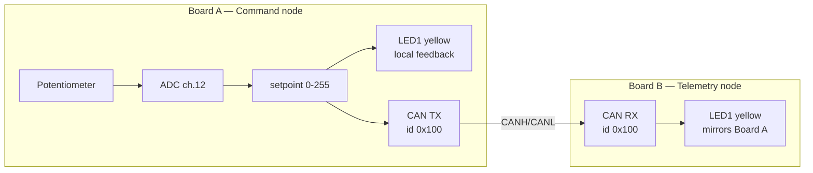

# PSOC™ Control — Command & Telemetry over CAN
### Advanced Zephyr Lab Guide (DevCon FAE Training, Session 2)

|  |  |
| --- | --- |
| **Board** | KIT_PSC3M5_CC2 (PSOC™ Control C3M5), two per pair |
| **Duration** | 60 minutes |
| **Prerequisite** | A working workspace from the intro session — see §3 |
| **You will touch** | Devicetree, Kconfig, and application code |
| **Status** | Hardware-validated end to end on two boards |

App source: `labs/` in the training repo. Developer/build reference:
`labs/README.md`.

---

## 1. Why this lab is shaped the way it is

This lab is the **sensing → networking → actuation plumbing** that a real
motor-control or power-conversion system is built on: read an analog input,
package it, put it on a real-time fieldbus, and act on it at the far end.
PSOC™ Control targets motor control and power conversion, and CAN/CAN FD is a
common fieldbus in those systems — which is why the hour is spent here.

**This is not a closed-loop motor control demo.** Zephyr is capable of running
motor control, and there are products doing exactly that — but a control loop
is its own design exercise, with its own timing analysis, and it does not fit
in sixty minutes. What you are building here is the layer such a loop sits on
top of.

The reason it takes an hour is that the three places a Zephyr application is
actually assembled all have to agree with each other. **Devicetree** says what
hardware exists. **Kconfig** says what software gets built. **Application
code** says what any of it is for. When they disagree, the board usually says
nothing at all.

It is also a **paired lab**. Your board is half of a system, and the finish
line needs both halves running.

---

## 2. What you're building

Each pair of attendees gets **two boards** running the **same lab project**,
built twice with a different role selected each time:

| Role | Nickname | What it does |
|---|---|---|
| **Command node** (Board A) | "the knob" | Reads the on-board potentiometer via ADC → converts to a 0–255 setpoint → drives its own LED1 brightness locally (instant feedback) → transmits the setpoint over CAN every 50 ms |
| **Telemetry node** (Board B) | "the mirror" | Receives the setpoint over CAN → drives its own LED1 to the same brightness |

Turn the pot on Board A → LED1 brightness changes immediately on **both**
boards, live. That live cross-board sync is the "aha" moment of the lab.



---

## 3. Before you start (3 min)

### Four checks

Everything here was done in the intro session. This is a check, not a setup —
but do it now rather than at minute 29, because none of it is fixable mid-lab.

1. **Your workspace exists and your toolchain is registered.** From inside
   `devcon-ws`:

```
   west sdk list
```

   You want version `1.0.1` with `arm-zephyr-eabi` listed. If the command is
   not recognised, you are not in `devcon-ws`.

2. **Your board enumerates.** One USB cable to the **debug USB connector**, and
   a COM port in Device Manager. Note the number — in this lab your partner has
   one too, and they will not be the same.

3. **Your serial console is open** at **115200 8N1**.

4. **You have flashed this board at least once** — the blinky from the intro
   session counts.

If any of these fail, pair with a neighbour for the hour. In a paired lab that
is less of a compromise than it sounds: you still need two boards between you
either way.

### Pick your tier

The lab ships as **three parallel copies of the same application**, differing
only in how much of the code is written for you. There is no instructor
allocation and no wrong answer — same lab, same steps, same step numbers.

| Tier | Pick it if | What the TODOs give you |
|---|---|---|
| **`can-lab-beginner`** | You want to see the system work end to end, or you'd rather not fight API signatures under time pressure | Everything the advanced tier gives you, **plus** a paste block containing the exact code |
| **`can-lab-advanced`** | You want to write the driver calls yourself | The function to call, its arguments described in prose, what to do with the result, and a link to the API reference — but **no line you can transcribe** |
| **`can-lab-cheat`** | You're behind, or you'd rather read working code than write it | The finished code, with every TODO comment still in place beside its answer |

**Switching tiers mid-lab costs you nothing.** Steps 1 and 2 are
byte-identical across all three trees, so you can copy your overlay and
`prj.conf` across and carry on. If you are undecided, take `can-lab-beginner`.

`can-lab-cheat` exists for a specific reason: **this is a paired lab, and it
only works if both boards run.** If you're stuck, taking the finished code is
a better outcome than stranding your partner. Use it without ceremony.

The rest of this guide writes the folder as `<tier>`.

### The build command you'll use all hour

Your first build names everything; every build after it is a short form,
because `-d build/lab` means west reuses the same build directory and already
remembers your board and source tree. From inside `devcon-ws`:

```
west build -b kit_psc3m5_cc2 -d build/lab -s devcon-training-2026/labs/can-lab-<tier> -- -DEXTRA_CONF_FILE=conf/role_command.conf
west flash -d build/lab
```

After that, a rebuild is just:

```
west build -d build/lab
west flash -d build/lab
```

**Nothing is pre-built.** Your first build is in §7, takes a minute or two,
and every build after it is incremental.

---

## 4. Your board at a glance

### The two user LEDs, and the one off-by-one

**The silkscreen and the devicetree disagree by one.** The board labels its
LEDs starting at 1; Zephyr's aliases start at 0. Worth fixing in your head
now rather than at minute 40:

| Silkscreen | Colour | Devicetree alias | Pin | Used in this lab for |
|---|---|---|---|---|
| **LED1** | Yellow | `led0` | P9.4 | Brightness / setpoint — this is the one that tracks the knob |
| **LED2** | Red | `led1` | P9.5 | CAN activity heartbeat — rapid blinking is **normal** |
| *(not an LED)* | — | `cmd-pwm` | **P9.0, at connector X19** | The real hardware PWM output — the scope test point |

This guide uses the silkscreen names in prose, because that is what you are
looking at, and the alias names when talking about code.

> **One line in the overlay is already filled in for you.** The board's
> devicetree declares both user LEDs active-low, but on these cards they
> light on a high output, so the overlay overrides the polarity. It is marked
> `PROVIDED` — you do not need to touch it. It is a good example of what an
> overlay is for: correcting or extending a board description without
> forking the board.

### Why the LED is driven in software, not by the PWM peripheral

Neither P9.4 nor P9.5 has a TCPWM option in its pin-mux table — their only
non-GPIO routes are SPI chip selects. A hardware PWM signal physically cannot
be muxed onto them. So the lab does both things at once:

- You enable and drive the **real hardware TCPWM peripheral**. That output is
  live on P9.0 and you can put a scope on it.
- The same duty cycle is **mirrored onto LED1 in software** by a provided
  helper (`src/lab_led_softpwm.c`), so the whole room can see it without a
  scope.

On this board soft-PWM is the correct implementation for an LED, not a
workaround. The pin simply does not go there.

> **Do not probe P9.0 casually.** It is schematic net V2_H — motor 2, phase V,
> high-side gate drive — brought out on the 100-pin power board connector.
> Driving it is safe **only with no motor-control power board attached**,
> which is how this lab is run. Do not fit a power board while running the lab.

### Two more board facts

**Flashing needs no special setup.** The kit carries an onboard isolated
SEGGER J-Link LITE, so `west flash` finds the board on its own.

**The potentiometer turns backwards.** Fully clockwise is 0%, fully
anticlockwise is 100%. Expected, not a fault.

---

## 5. Touchpoint 1 — Devicetree (10 min)

File: `labs/can-lab-<tier>/boards/kit_psc3m5_cc2.overlay`

> The file is named after the board, which is how Zephyr picks it up
> automatically when you build with `-b kit_psc3m5_cc2`. You never reference
> it from a build command.

### What an overlay is actually for

The board's own devicetree already describes everything physically present on
KIT_PSC3M5_CC2 — every pin, every peripheral instance, the pot, the LEDs. What
it deliberately does **not** do is decide which of that your application uses.
A board file that switched on every peripheral would cost every application
flash, RAM and boot time it did not ask for.

So most peripherals ship `status = "disabled"`, and an **overlay** is where
your application says "I want this one, and here is how I intend to use it."
That is the whole job of this touchpoint.

Two things worth holding on to while you edit it:

- **Nothing here executes.** Devicetree is a description. The build turns it
  into C macros that the drivers read at compile time, which is why a mistake
  here usually shows up as a missing symbol rather than a runtime fault.
- **Aliases decouple your code from the hardware.** Your application asks for
  `cmd-pwm`, not for `tcpwm2_6`. Point the alias at a different pin and the
  application does not change — which is exactly how one firmware tree
  supports several board builds.

### What you're adding

CAN is already enabled for you at the board level — nothing to do there. Your
job is the **ADC** (the potentiometer) and the **PWM** (the command output),
marked `TODO 1a`/`1b`/`1c` in the file:

| TODO | What you uncomment | Why it is needed |
|---|---|---|
| **1a** | The `io-channels` property in `zephyr,user`, then `status = "okay";` under `&adc0` | `zephyr,user` is the standard place for application-specific devicetree references — it is how the app asks for "the pot" by name instead of hard-coding a channel number. The `status` line powers up the ADC controller itself |
| **1b** | The `channel@c` block | Describes ADC channel 12 — gain, reference, acquisition time and resolution. The pin mapping is fixed by the board; you are telling Zephyr how you want that channel sampled |
| **1c** | The PWM block (`&tcpwm2_6` on P9.0), the `pwmleds` block, and the `cmd-pwm` alias | Three pieces that have to agree: the peripheral turned on, a named PWM consumer the app can open, and the alias the app actually looks up |

TODO 1c is the one most people get partly right — it is easy to enable the
peripheral and forget the alias. The starting application catches that for you
with a one-line build error. In the field, nothing will.

> **Stuck?** `labs/can-lab-cheat/boards/kit_psc3m5_cc2.overlay` is the finished
> version of this exact file, with every TODO comment still in place beside its
> answer. Reading it costs you nothing.

---

## 6. Touchpoint 2 — Kconfig (2 min)

File: `labs/can-lab-<tier>/prj.conf`

Devicetree said the hardware exists. Kconfig decides whether the **driver** for
it gets compiled in at all. Both have to be true, and forgetting this one is
the single most common first-week Zephyr mistake.

Uncomment two lines:

```
CONFIG_ADC=y
CONFIG_PWM=y
```

(`CONFIG_CAN=y` is already on in the baseline.)

---

## 7. Checkpoint — your first build (5 min)

Build and flash now, before writing any code. It takes about two minutes and
proves your devicetree and Kconfig edits are correct **in isolation** — which
is far easier than debugging them later with half-finished application code in
the way.

```
west build -b kit_psc3m5_cc2 -d build/lab -s devcon-training-2026/labs/can-lab-<tier> -- -DEXTRA_CONF_FILE=conf/role_command.conf
west flash -d build/lab
```

It should build with exactly two warnings — `'can_dev' defined but not used`
and `'tx_done_cb' defined but not used`. Both are correct: you have not called
`can_send()` yet. Expected console:

```
*** Booting Zephyr OS build ... ***
[00:00:00.000,335] <inf> command_node: Command node starting (PSOC Control CAN lab)
[00:00:00.000,335] <inf> command_node: setpoint 128 (50%)
[00:00:00.502,502] <inf> command_node: setpoint 128 (50%)
```

| What you should see | Why |
|---|---|
| **LED1 (yellow) at a constant 50%** | The PWM path from Steps 1 and 2 works |
| **LED2 (red) blinking rapidly** | The heartbeat is provided code |
| **The knob does nothing**, setpoint pinned at `128` | Correct — `read_setpoint()` is still a stub |
| **No CAN traffic at all** | Correct — `send_setpoint()` is still empty |

If the console is silent or LED1 is dark, the problem is in Step 1 or Step 2 —
not in code you have not written yet.

### If you build again before you've finished Step 3

The tree tells you what is missing rather than failing in a way you have to
guess at. Each guard names the **next** step:

| Where you are | Result |
|---|---|
| Step 1 not done | ❌ `#error "... Complete Step 1 (TODO 1a/1b)"` |
| Step 1 done, Step 2 not | ❌ `#error "CONFIG_PWM is not enabled. Complete Step 2"` |
| Steps 1 + 2 done | ✅ builds, two warnings (above) |
| + TODO 3a | ✅ `can_dev` warning clears |
| All TODOs done | ✅ clean, no warnings |

---

## 8. Touchpoint 3 — Code (25 min)

Files: `src/command_node.c` (Board A role) and `src/telemetry_node.c`
(Board B role).

Unlike Steps 1 and 2 you **type this rather than uncomment it**. The point is
to get your hands on the actual Zephyr APIs — `device_is_ready()`,
`can_set_bitrate()`, `adc_read_dt()`, `can_send()` — because those are what
you'll reach for on a real project. Every TODO names the exact functions and
the order to call them in.

> **You complete *both* files.** You are not splitting the work with your
> partner. Both roles are built from the same tree; a Kconfig fragment picks
> which `.c` file is compiled in. You'll see that pay off in §9.

**Command node (`src/command_node.c`) — four TODOs:**

| TODO | What you write |
|---|---|
| **3a** | Bring up the CAN controller in `run_command_node()`: `device_is_ready()`, then `can_set_bitrate()`, `can_set_mode()`, `can_start()` — in that order |
| **3b** | In `read_setpoint()`: call `adc_read_dt()`, then scale the 12-bit sample (0–4095) down to an 8-bit setpoint (0–255). *Hint: 12 bits is 4 more bits than 8, and a right-shift halves a value* |
| **3c** | In `send_setpoint()`: fill a `struct can_frame` (`.id`, `.dlc`, `.data[0]`) and hand it to `can_send()` |
| **3d** | One line in `run_command_node()`: `adc_channel_setup_dt(&pot_adc)` — the channel must be configured once before it can be read |

**Telemetry node (`src/telemetry_node.c`) — three TODOs:**

| TODO | What you write |
|---|---|
| **3a** | Identical CAN bring-up to the command node's 3a. Both boards must use the same bitrate |
| **3b** | Declare a `struct can_filter` for `CAN_ID_SETPOINT` and register it with `can_add_rx_filter_msgq()`. **Without a filter the controller receives nothing** — the step people most often forget |
| **3c** | In `unpack_setpoint()`: read the setpoint back out of `frame->data[0]`, checking `frame->dlc` first |

Everything else is provided. You write no PWM code — LED brightness is handled
in `src/lab_led.c`, which is why PWM appears in Steps 1 and 2 but not here.
`can_protocol.h` holds the shared constants so both roles agree on the wire
format.

> **A note on style.** The lab code omits error checks on calls that can't
> realistically fail on a known-good board, to keep each function short enough
> to read in one go. Production code should check them — `can-lab-production`
> (§11) keeps the full error handling and is the version to show a customer.

> **Stuck?** Diff your file against `can-lab-cheat` rather than copying the
> whole thing — you'll see exactly which TODO is unfinished.

---

## 9. Bring the pair up (10 min)

Two phases, in this order. The first is deliberately a single-board test, so
that if something is wrong you know it is your board and not the link.

### Phase 1 — Everyone runs the command role, boards NOT wired

Each partner builds and flashes the **command** role on their own board:

```
west build -d build/lab
west flash -d build/lab
```

Expected console:

```
*** Booting Zephyr OS build ... ***
[00:00:00.000,366] <inf> command_node: Command node starting (PSOC Control CAN lab)
[00:00:00.000,427] <inf> command_node: setpoint 52 (20%)
[00:00:00.001,281] <wrn> command_node: CAN send failed - is the second board powered and wired?
[00:00:00.502,180] <inf> command_node: setpoint 52 (20%)
[00:00:01.003,769] <inf> command_node: setpoint 61 (23%)
```

| What | Expected |
|---|---|
| LED1 (yellow) | Brightness **tracks the potentiometer** immediately |
| LED2 (red) | Blinking very rapidly |
| Console `setpoint` | Sweeps the full 0–255 / 0–100% range as you turn the knob |
| Console warnings | Exactly **one** `CAN send failed` line, near the top |

> **That CAN warning is good news.** A lone CAN node has nobody to acknowledge
> its frames, so its transmit mailboxes fill and `can_send()` starts refusing
> new frames. Seeing the warning means your controller and transceiver actually
> came up — a board that never got that far would print nothing. It appears
> once, and a `CAN send recovered` line follows the moment a second node joins.

At the end of Phase 1 every attendee has independently proven ADC → PWM →
console, with no dependency on their partner.

### Phase 2 — One partner switches role, then wire the pair together

**One** of the two boards rebuilds as the telemetry node. Same source tree,
same build directory, same code you just wrote — one different build flag:

```
west build -d build/lab -- -DEXTRA_CONF_FILE=conf/role_telemetry.conf
west flash -d build/lab
```

No `--pristine`, and no need to name the board or source tree again: west
notices the changed Kconfig fragment and re-runs configuration for you.

Now connect the two boards' CAN connectors with three wires:

| Board A | Board B |
|---|---|
| CANH | CANH |
| CANL | CANL |
| GND | GND |

You are wiring transceiver-to-transceiver — each board has an on-board
TLE9371VSJ behind a digital isolator — not MCU pin to MCU pin. No termination
resistor is needed at bench distances; a production bus needs 120 Ω at each end.

> **There is no transceiver node in the overlay, and that is correct.** This
> board's transceiver is permanently enabled in hardware, so there is nothing
> for software to switch on. Boards that gate it with a GPIO do need one.

Within a second of the last wire, both consoles should log `CAN send
recovered`, the telemetry board should print `CAN link up - receiving
setpoints`, and **its LED1 should follow the other board's knob** within about
50 ms. That is the finish line.

> **This is the payoff for the role-select design.** Nothing was recompiled
> from different sources and no code changed — one Kconfig fragment selected a
> different `.c` file, and the board changed role. That is how a real product
> family ships one firmware tree across several node types.

---

## 10. Verification and troubleshooting (5 min)

Serial settings for both boards: **115200 8N1, no flow control** — the console
is on `uart1`, exposed through the onboard J-Link LITE USB-UART bridge.

All four of these should be true:

| # | Check | Expected |
|---|---|---|
| 1 | Both consoles | A `command_node` / `telemetry_node` banner at boot, then a `setpoint <n> (<n>%)` line about twice a second |
| 2 | **Turn Board A's knob** | Board A's LED1 brightness changes immediately, and its console `setpoint` sweeps |
| 3 | **Watch Board B while turning Board A's knob** | Board B's LED1 tracks Board A's within ~50 ms. **This is the finish line** |
| 4 | Both boards' LED2 | Blinks on every CAN TX attempt or frame received. At 50 ms this is **very rapid; that is correct** |

| Symptom | Cause and fix |
|---|---|
| `setpoint` pinned at exactly `128`, never moves | A placeholder is still in place — TODO 3b (command) or TODO 3c (telemetry) |
| **Both** LEDs follow **their own** knob, consoles look clean | Both boards were flashed as the command node. It looks like a working system — the only tell is that turning one knob does nothing to the other board. Reflash one with `conf/role_telemetry.conf` |
| Neither LED responds; both print `No setpoint for 500 ms` | Both flashed as telemetry — nobody is transmitting. Reflash one with `conf/role_command.conf` |
| Board B prints nothing after its boot banner | The RX filter was never registered (TODO 3b). Without it the controller receives nothing, even with perfect wiring |
| No `CAN send recovered` line after wiring | Check both boards are powered and programmed, then all three wires. **CANH must reach CANH and CANL must reach CANL** — the ground wire is never the cause |

> **Give it ten seconds after fixing a wire.** A controller that has gone
> error-passive heals one count per successful frame, which at this lab's send
> interval is about six seconds. A pair that looks dead right after a re-wire
> may simply not have finished recovering.

> **Nothing on this connector is destructive.** CAN transceivers are required
> to survive CANH/CANL shorted to ground, to VCC and to each other, and nothing
> here exceeds 5 V. Experiment freely.

---

## 11. Reference

### The fourth application tree

| App | Who it's for | What it is |
|---|---|---|
| **`can-lab-production`** | Instructors, and FAEs showing customers | The same application with full error handling on every driver call, no TODOs, plus a duplicate-command-node detector that reports the §10 failure mode explicitly on the console |

It sits on a different axis from the three tiers — it isn't "harder", and
nobody writes it inside the hour.

### Looking things up while you work

Every TODO ends with a **`Docs:`** line linking to the Zephyr reference page
for the calls that step needs. You are not expected to work from memory.

The distinction worth taking away from the hour:

| | Page | What it tells you |
|---|---|---|
| **The API you call** | [`group__can__interface.html`](https://docs.zephyrproject.org/latest/doxygen/html/group__can__interface.html) | `can_send()`, `can_start()`, `struct can_frame` — what your application uses |
| **The API a driver implements** | [`structcan__driver__api.html`](https://docs.zephyrproject.org/latest/doxygen/html/structcan__driver__api.html) | The table of function pointers Infineon's driver fills in behind those calls |

That split is why the `can_send()` you write here would run unchanged on a
different vendor's Zephyr board: your application targets the generic API, and
the vendor driver supplies the implementation underneath. It is also why the
devicetree work in Step 1 matters — devicetree is what binds the generic API to
this particular silicon.

| Area | Page |
|---|---|
| ADC API | https://docs.zephyrproject.org/latest/doxygen/html/group__adc__interface.html |
| ADC concepts and devicetree properties | https://docs.zephyrproject.org/latest/hardware/peripherals/adc.html |
| CAN controller concepts | https://docs.zephyrproject.org/latest/hardware/peripherals/can/controller.html |
| PWM concepts | https://docs.zephyrproject.org/latest/hardware/peripherals/pwm.html |
| Devicetree — what an overlay is | https://docs.zephyrproject.org/latest/build/dts/intro.html |
| Devicetree — every in-tree binding | https://docs.zephyrproject.org/latest/build/dts/api/bindings.html |
| Kconfig — searchable index of every `CONFIG_` symbol | https://docs.zephyrproject.org/latest/kconfig.html |

The last two are the ones worth bookmarking. "What properties can this node
have?" is answered by the bindings index; "what does this `CONFIG_` do?" by the
Kconfig index.

### Build times

| Build | Roughly |
|---|---|
| Your first build (§7, clean) | **1½ – 2 minutes** |
| Role switch, Phase 2 | 1½ minutes |
| An edit to your overlay | 40 seconds |
| An edit to a `.c` file only | under 10 seconds |
| Re-running a build you have already done | 2 seconds |

The first build is slow because nothing has been compiled for your board yet.
Everything after it reuses `build/lab`. A Kconfig change — which is what the
Phase 2 role switch is — invalidates enough of the tree to rebuild most of it,
and is still faster than `--pristine`.

### If something doesn't behave as described

Every step in this lab has been run end to end on two physical boards, wired
CANH/CANL/GND, including the deliberate failure modes. If something here does
not behave the way the guide says it will, that is worth raising rather than
working around.
