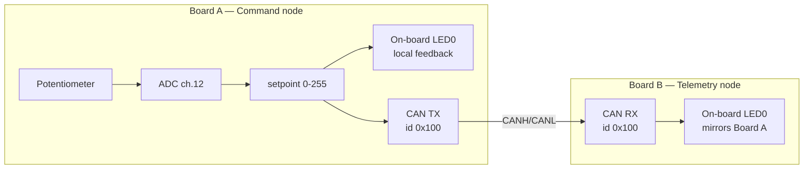
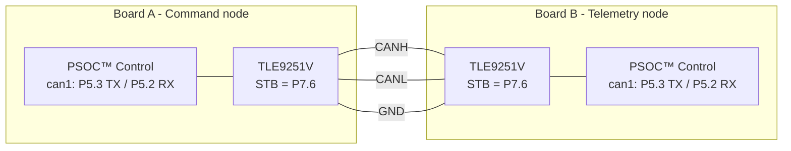

# PSOC™ Control — Command & Telemetry over CAN
### Advanced Zephyr Lab Guide (DevCon FAE Training, Session 2)

|  |  |
| --- | --- |
| **Board** | KIT_PSC3M5_EVK (PSOC™ Control C3M5), two per pair — or KIT_PSC3M5_CC2, see §11 |
| **Duration** | 60 minutes |
| **Prerequisite** | A working workspace from the intro session — see §3 |
| **You will touch** | Devicetree, Kconfig, and application code |
| **Status** | Hardware-validated end to end on both board variants |

App source: `labs/` in the training repo. Developer/build reference:
`labs/README.md`.

---

## 1. Why this lab is shaped the way it is

This lab is the **sensing → networking → actuation plumbing** that a real
motor-control or power-conversion system is built on: read an analog input,
package it, put it on a real-time fieldbus, and act on it at the far end.
PSOC™ Control targets motor control and power conversion, and CAN/CAN FD is a
common fieldbus in those systems — which is why the hour is spent here.

**This is not a closed-loop motor control demo.** The real control loop in a
production system runs in dedicated real-time firmware — not in Zephyr, and
not in sixty minutes. What you are building is the layer that loop sits on
top of.

The reason it takes an hour is that the three places a Zephyr application is
actually assembled all have to agree with each other. **Devicetree** says what
hardware exists. **Kconfig** says what software gets built. **Application
code** says what any of it is for. When they disagree, the board usually says
nothing at all — and this lab makes them disagree, deliberately, more than
once.

It is also a **paired lab**. Your board is half of a system, and the finish
line needs both halves running. That shapes everything from §3 onward.

---

## 2. What you're building

Each pair of attendees gets **two boards** running the **same lab project**,
built twice with a different role selected each time:

| Role | Nickname | What it does |
|---|---|---|
| **Command node** (Board A) | "the knob" | Reads the on-board potentiometer via ADC → converts to a 0–255 setpoint → drives its own on-board LED0 brightness locally (instant feedback) → transmits the setpoint over CAN every 50 ms |
| **Telemetry node** (Board B) | "the mirror" | Receives the setpoint over CAN → drives its own on-board LED0 to the same brightness → "remote node responds and reports back" |

Turn the pot on Board A → LED0 brightness changes immediately on **both**
boards, live. That live cross-board sync is the "aha" moment of the lab.



---

## 3. Setup verification (3 min)

Everything here was done in the intro session. This is a check, not a setup —
but do it now rather than at minute 29, because none of it is fixable mid-lab.

1. **Your workspace exists and your toolchain is registered.** From inside
   `devcon-ws`:

```
   west sdk list
```

   You want version `1.0.1` with `arm-zephyr-eabi` listed. If the command is
   not recognised, you are not in `devcon-ws`.

2. **Your flash configuration survived.** Still in `devcon-ws`:

```
   west config build.cmake-args
```

   This should print a line pointing at the ModusToolbox™ Programming Tools
   OpenOCD. If it says `build.cmake-args is unset`, re-run the `west config`
   command from the setup guide now — without it `west flash` cannot reach the
   board.

3. **Your board enumerates.** One USB cable to the KitProg3 connector, and a
   COM port in Device Manager. Note the number — in this lab your partner has
   one too, and they will not be the same.

4. **Your serial console is open** at **115200 8N1**.

5. **You have flashed this board at least once** — the blinky from the intro
   session counts, and is the whole reason that session ended with one.

### Pick your tier now

The lab ships as **three parallel copies of the same application**, differing
only in how much of the code is written for you. Nobody assigns you one, and
you can move between them mid-lab at no cost. §9 describes them in full; if
you are undecided, take `can-lab-beginner`.

| Tier | Pick it if |
|---|---|
| `can-lab-beginner` | You want to see the system work end to end without fighting API signatures under time pressure |
| `can-lab-advanced` | You want to write the driver calls yourself |
| `can-lab-cheat` | You would rather read working code than write it |

The rest of this guide writes the folder as `<tier>`. Substitute whichever you
chose — **the step numbering is identical in all three.**

If any of the five checks above fail, pair with a neighbour for the hour. In a
paired lab that is less of a compromise than it sounds: you still need two
boards between you either way.

> **Nothing is pre-built.** Your first build happens in §6, takes about two
> minutes, and every build after it is incremental.

---

## 4. LED labelling — read this before you debug

The silkscreen and the devicetree are **off by one**. This confuses people
every time:

| Silkscreen | Devicetree alias | Pin | Used in this lab for |
|---|---|---|---|
| **LED1** (blue) | `led0` | P8.5 | Brightness / setpoint — this is the one that should track the knob |
| **LED2** (orange) | `led1` | P8.4 | CAN activity heartbeat — rapid blinking is **normal** |

---

## 5. The three touchpoints (40 min)

Both boards build from the **same files in your chosen tree** — only the
Kconfig role fragment (`conf/role_command.conf` vs `conf/role_telemetry.conf`)
differs, which drives which `.c` file gets compiled in.

> **Everyone completes *all* the touchpoints, for *both* roles.** You are
> not splitting the work with your partner. Every attendee edits the
> overlay, `prj.conf`, `command_node.c` **and** `telemetry_node.c`, then
> builds the **command** role first (§6, Phase 1). Because both roles are
> already written, switching a board to telemetry later is a one-flag
> rebuild with no new code — which is the whole point of the role-select
> design, and you'll see it pay off in Phase 3.

### Touchpoint 1 — Devicetree (`can-lab-<tier>/boards/<your-board>.overlay`)

> On KIT_PSC3M5_EVK that file is `boards/kit_psc3m5_evk.overlay`; on
> KIT_PSC3M5_CC2 it is `boards/kit_psc3m5_cc2.overlay`. The TODO numbering
> is identical in both — only the peripheral and pin names differ (§11).
> Edit the one matching the board you are building for; the other is
> ignored by the build.

CAN is already enabled for you at the board level — nothing to do there.
Your job is to enable the **ADC** (potentiometer) and **PWM** (command
output) nodes, all clearly marked `TODO 1a`/`1b`/`1c` in the overlay file:

1. **TODO 1a:** uncomment the `io-channels` property in `zephyr,user` so
   the app can request the potentiometer channel by name.
2. **TODO 1a (cont'd):** uncomment `status = "okay";` under `&adc0` to
   turn the ADC controller on.
3. **TODO 1b:** uncomment the `channel@c` block describing ADC channel 12
   (the on-board potentiometer — this pin mapping is fixed by the board,
   you're just telling Zephyr about it).
4. **TODO 1c:** uncomment the PWM block (enables the hardware PWM
   peripheral and routes it to the lab's output pin — `&tcpwm1_4` on P4.0,
   mikroBUS header 1, for the EVK; `&tcpwm2_6` on P9.0 for the CC2) and the
   `pwmleds` block further up (gives the app a named PWM device to open),
   plus the `cmd-pwm` alias in `aliases { }`.

Stuck? On the EVK, `samples/drivers/adc/adc_dt/boards/kit_psc3m5_evk.overlay`
and `samples/basic/fade_led/boards/kit_psc3m5_evk.overlay` in the Zephyr tree
show the same nodes fully enabled. Those samples carry **no CC2 overlay**, so
on the CC2 use `can-lab-production/boards/kit_psc3m5_cc2.overlay` in this repo
as the worked reference instead.

### Touchpoint 2 — Module import (`can-lab-<tier>/prj.conf`)

Uncomment two lines to turn on the driver subsystems the devicetree nodes
above need:

```
CONFIG_ADC=y
CONFIG_PWM=y
```

(`CONFIG_CAN=y` is already on in the baseline — see §3.)

### Touchpoint 3 — Code

This is the real logic, and unlike Steps 1 and 2 you **type this rather
than uncomment it**. The point is to get your hands on the actual Zephyr
APIs — `device_is_ready()`, `can_set_bitrate()`, `adc_read_dt()`,
`can_send()` — because those are what you'll reach for on a real project.
Every TODO comment names the exact functions to call and the order to
call them in, so you're never guessing at an API you haven't seen.

Files: `src/command_node.c` (Board A role) and `src/telemetry_node.c`
(Board B role).

**Command node (`src/command_node.c`) — four TODOs:**

| TODO | What you write |
|---|---|
| **3a** | Bring up the CAN controller in `run_command_node()`: `device_is_ready()`, then `can_set_bitrate()`, `can_set_mode()`, `can_start()` — in that order |
| **3b** | In `read_setpoint()`: call `adc_read_dt()`, then scale the 12-bit sample (0–4095) down to an 8-bit setpoint (0–255). *Hint: 12 bits is 4 more bits than 8, and a right-shift halves a value* |
| **3c** | In `send_setpoint()`: fill a `struct can_frame` (`.id`, `.dlc`, `.data[0]`) and hand it to `can_send()` |
| **3d** | One line in `run_command_node()`: `adc_channel_setup_dt(&pot_adc)` — the channel must be configured once before it can be read |

**Telemetry node (`src/telemetry_node.c`) — three TODOs:**

| TODO | What you write |
|---|---|
| **3a** | Identical CAN bring-up to the command node's 3a. Both boards must use the same bitrate |
| **3b** | Declare a `struct can_filter` for `CAN_ID_SETPOINT` and register it with `can_add_rx_filter_msgq()`. **Without a filter the controller receives nothing** — this is the step people most often forget |
| **3c** | In `unpack_setpoint()`: read the setpoint back out of `frame->data[0]`, checking `frame->dlc` first |

Everything else is provided. You don't write any PWM code — LED brightness
is handled for you in `src/lab_led.c`, which is why PWM appears in Steps 1
and 2 but not here. `can_protocol.h` holds the shared constants
(`CAN_ID_SETPOINT`, `CAN_DLC_SETPOINT`, `CAN_BITRATE`) so both roles agree
on the wire format.

> **A note on style.** The lab code omits error checks on calls that
> can't realistically fail on a known-good EVK, to keep each function
> short enough to read in one go. Production code should check them.
> The `can-lab-production` tree (§9) keeps the full error handling and is
> the version to show a customer.

### If you build before you've finished

You can build at any point — the tree tells you what's still missing rather
than failing in a way you have to guess at. Each compile-time guard names
the **next** step, so a half-finished lab is never a mystery.

| Where you are | `west build` | What you see |
|---|---|---|
| Nothing done yet | ❌ fails | `#error "... Complete Step 1 (TODO 1a/1b)"` (command) or `TODO 1c` (telemetry) |
| Step 1 done, Step 2 not | ❌ fails | `#error "CONFIG_PWM is not enabled. Complete Step 2 (prj.conf, TODO 2)"` |
| Steps 1 + 2 done, no code yet | ✅ builds | Two warnings: `'can_dev' defined but not used` and `'tx_done_cb' defined but not used` — correct, you haven't called `can_send()` yet |
| + TODO 3a (CAN bring-up) | ✅ builds | `can_dev` warning clears; `tx_done_cb` remains until 3c |
| All TODOs done | ✅ builds | Clean, no warnings |

**It is worth flashing the Steps 1 + 2 build**, before you write any code —
it takes 30 seconds and proves your devicetree and Kconfig edits were
correct in isolation:

```
*** Booting Zephyr OS build ... ***
[00:00:00.000,335] <inf> command_node: Command node starting (PSOC Control CAN lab)
[00:00:00.000,335] <inf> command_node: setpoint 128 (50%)
[00:00:00.502,502] <inf> command_node: setpoint 128 (50%)
```

- **LED1 (blue) sits at a constant 50%** — the PWM path from Step 1/2 works
- **LED2 (orange) blinks rapidly** — the heartbeat is provided code
- **The knob does nothing**, and the setpoint is pinned at `128` — correct,
  `read_setpoint()` is still the stub that returns a fixed value
- **No CAN messages at all** — also correct, `send_setpoint()` is still empty

If the console is silent or LED1 is dark at this point, the problem is in
Step 1 or Step 2, not in code you haven't written yet.

---

## 6. Build, flash, and bring the pair up (10 min)

Do this in three phases, in this order. **Do not wire the boards together
yet** — the first phase is deliberately a single-board test, so that if
something is wrong you know it is your board and not the link.

### Phase 1 — Everyone flashes the command role, boards NOT wired

Each partner builds and flashes the **command** role on their own board. This
is your first build, so it carries the full command — board, build directory
and source tree. From inside `devcon-ws`:

```
west build -b kit_psc3m5_evk -d build/lab -s devcon-training-2026/labs/can-lab-<tier> -- -DEXTRA_CONF_FILE=conf/role_command.conf
west flash -d build/lab
```

Substitute `<tier>` with the folder you picked in §3. **This clean build takes
a minute or two**; every build after it is incremental and much faster,
because `-d build/lab` means west reuses the same build directory and already
knows your board and source tree. From here on the guide writes the short
form.

Expected console:

```
*** Booting Zephyr OS build ... ***
[00:00:00.000,366] <inf> command_node: Command node starting (PSOC Control CAN lab)
[00:00:00.000,427] <inf> command_node: setpoint 52 (20%)
[00:00:00.001,281] <wrn> command_node: CAN send failed - is the second board powered and wired?
[00:00:00.502,180] <inf> command_node: setpoint 52 (20%)
[00:00:01.003,769] <inf> command_node: setpoint 61 (23%)
```

Check all four of these before moving on:

| What | Expected |
|---|---|
| LED1 (blue) | Brightness **tracks the potentiometer** immediately |
| LED2 (orange) | Blinking very rapidly |
| Console `setpoint` | Sweeps the full 0–255 / 0–100% range as you turn the knob |
| Console warnings | Exactly **one** `CAN send failed` line, near the top |

> **That CAN warning is expected and it is good news.** A lone CAN node has
> nobody to acknowledge its frames, so the controller retransmits them
> forever, its transmit mailboxes fill up, and `can_send()` starts refusing
> new frames. Seeing the warning means your CAN controller and transceiver
> actually came up — a board that never got that far would print nothing at
> all. It appears once and then stays quiet (the code only reports the
> *change* of state, not every failed send), and you'll see a matching
> `CAN send recovered` line the moment a second node joins the bus.

> **Why the callback argument matters.** `can_send()` is handed a small
> do-nothing `tx_done_cb` rather than `NULL`. This is not cosmetic. With a
> `NULL` callback Zephyr blocks until the frame is acknowledged, and a node
> alone on the bus is *never* acknowledged: it
> settles at error-passive rather than bus-off, so the driver retries
> indefinitely and the application hangs on its very first send. Passing a
> callback makes the send fire-and-forget, which is what lets Phase 1 work
> at all — worth knowing if the signature ever looks over-specified to you.

At the end of Phase 1 every attendee has independently proven ADC → PWM →
console, with no dependency on their partner.

### Phase 2 — Wire the pair together (still both command nodes)

KIT_PSC3M5_EVK brings CAN out on a **screw terminal**, fed by an on-board
**TLE9251VLEXUMA1** CAN transceiver. You are wiring transceiver-to-transceiver
(true differential CAN), not MCU pin to MCU pin. Connect the two boards'
screw terminals with three wires:

| Board A | Board B |
|---|---|
| CANH | CANH |
| CANL | CANL |
| GND | GND |



**Verified on hardware:** with both boards powered and these three wires
connected, the lab runs correctly with no extra termination resistor at the
short (bench-length) distances used in the classroom. A production CAN bus
needs 120 Ω at each end; if you extend the wiring significantly or see
intermittent frame loss, add termination.

> ### The transceiver standby pin (already handled for you)
>
> The TLE9251V's **STB (standby) pin is wired to P7.6** and has an internal
> pull-up, so the transceiver powers up in **standby**: its transmitter is
> disabled and the node cannot even acknowledge frames. The upstream
> `kit_psc3m5_evk` devicetree does **not** model the transceiver, so nothing
> releases STB by default.
>
> The lab's overlay works around this with a `can-transceiver-gpio` node
> referenced from `can1` via `phys`, so Zephyr drives STB low on
> `can_start()`. `prj.conf` also sets `CONFIG_CAN_TRANSCEIVER_INIT_PRIORITY=55`,
> because the Infineon GPIO driver initialises at priority 50 (not the usual
> 40) and the transceiver's default of 45 would otherwise run before its own
> GPIO port is ready.
>
> **Symptom if this is ever removed or broken:** `can_send()` returns
> `-ENETUNREACH` (errno 114 under picolibc) within ~1 ms of boot, with the
> error counters reading zero — the controller is repeatedly going bus-off
> from unacknowledged frames and auto-recovering. It looks like a wiring or
> termination fault but is not.

Both boards are still command nodes at this point. Watch what happens:

- **Both boards log `CAN send recovered - partner board is on the bus`**
  within a second of the last wire going in. The link is healthy — the two
  boards are acknowledging each other's frames. (Verified on hardware by
  hot-plugging the harness into a running board.)
- **But neither LED follows the other board's knob.** Each board still
  only responds to its own potentiometer.

That is worth pausing on, because it is the single most common way this
lab goes wrong in the field: **two command nodes look like a working
system.** The bus is genuinely error-free (measured on hardware: both
controllers report `TEC = 0, REC = 0` after 12 seconds), nothing logs an
error, and both LEDs respond. The only tell is the one nobody checks —
turning *one* knob does nothing to the *other* board. See §7 for why.

### Phase 3 — One partner switches to the telemetry role

Only **one** of the two boards changes. Same source tree, same build
directory, same code you just wrote — one different build flag:

```
west build -d build/lab -- -DEXTRA_CONF_FILE=conf/role_telemetry.conf
west flash -d build/lab
```

You do not need `--pristine` and you do not need to name the board or the
source tree again: west remembers both, notices the changed Kconfig fragment,
and re-runs the configuration step for you.

That board's console should now print `CAN link up - receiving setpoints`,
and **its LED1 should follow the other board's knob** within about 50 ms.
That is the finish line.

> **This is the payoff for the role-select design.** Nothing was
> recompiled from different sources and no code changed — one Kconfig
> fragment selected a different `.c` file, and the board changed role.
> That is exactly how a real product family ships one firmware tree
> across several node types.

---

## 7. Verification — did it work? (5 min)

Serial settings for both boards: **115200 8N1, no flow control** — the
console is on `uart3` (P6.3 TX / P6.2 RX), exposed on the KitProg3 USB-UART
COM port.

Once Phase 3 is done, all five of these should be true:

| # | Check | Expected |
|---|---|---|
| 1 | Both consoles | A `command_node` / `telemetry_node` banner at boot, then a `setpoint <n> (<n>%)` line about twice a second |
| 2 | **Turn Board A's knob** | Board A's LED1 (blue) brightness changes immediately, and its console `setpoint` sweeps with the knob |
| 3 | **Watch Board B while turning Board A's knob** | Board B's LED1 tracks Board A's within ~50 ms, and its console prints `CAN link up - receiving setpoints` then matching values. **This is the finish line** — and it is the check that catches a same-role mis-flash |
| 4 | Both boards' LED2 (orange) | Blinks on every CAN TX attempt (Board A) or frame received (Board B). At a 50 ms interval this is **very rapid; that is correct** |
| 5 | *(bonus, if a scope is handy)* | The real hardware PWM signal is on mikroBUS 1 / pin P4.0 on both boards at the same duty cycle as the LED |

A `setpoint` pinned at exactly `128` that never moves means a placeholder is
still in place — TODO 3b (command) or TODO 3c (telemetry) isn't done.

**Troubleshooting**

| Symptom | Cause | Fix |
|---|---|---|
| No `CAN send recovered` line after the boards are wired together | The bus still isn't carrying frames. Note the warning is printed **once**, so the absence of a *recovery* line is the signal — not a stream of failures | In this order: confirm both boards are powered **and programmed**; check all three wires on the screw terminals; confirm the `can_phy` transceiver node is still in the overlay (§6). Then **wait ten seconds** before judging — see the recovery note below |
| **Both** LEDs follow **their own** knob; consoles look clean | **Both boards flashed as the command node.** The deceptive one — see below | Reflash one board with `conf/role_telemetry.conf` |
| Neither LED responds; both consoles print `No setpoint for 500 ms` | Both boards flashed as the telemetry node — nobody is transmitting | Reflash one board with `conf/role_command.conf` |
| Board B's console prints nothing after its boot banner | Telemetry node never registered its RX filter (TODO 3b) | Without a filter the controller receives nothing, even with perfect wiring |

**Miswiring — what actually happens (measured on hardware)**

The screw terminal is laid out **1-CANL / 2-CANH / 3-GND**, so CANL and GND
are the two outer positions. The most likely mistake is a three-wire harness
**plugged in backwards at one end**, which swaps CANL and GND and leaves CANH
in the middle untouched.

| Miswiring | Result |
|---|---|
| CANL ↔ GND swapped at **one** end | **Works normally.** Verified end-to-end with the boards on separate power sources. On a short two-node link the transceivers' own differential impedance sets the common-mode reference, so the GND wire is not load-bearing; the swap just ties the two floating grounds together harmlessly |
| CANL ↔ GND swapped at **both** ends | No fault at all — it is still CANL–CANL and GND–GND, just on different physical wires |
| GND omitted entirely (CANH + CANL only) | **Works normally** — verified even with the second board on a battery pack, so the grounds were genuinely floating. GND is a robustness measure here, not a requirement |
| Either CANH **or** CANL missing | **Fails.** The command node logs `CAN send failed` and LED sync stops. Reattaching the wire recovers the link automatically — no reset needed |
| CANH ↔ CANL crossed at one end | **Fails**, and presents exactly like a disconnected board — no distinct symptom to look for |

> **The whole matrix reduces to one rule:** CANH must reach CANH and CANL
> must reach CANL. Nothing else on this terminal matters. GND can be
> swapped, or left off entirely, with no effect. So when a pair won't link,
> check the middle terminal against its neighbour on both boards and ignore
> the ground wire — it is never the cause.

> **No miswiring on this kit is destructive.** ISO 11898-2 requires CAN
> transceivers to survive CANH/CANL shorted to ground, to VCC and to each
> other; the on-board TLE9251V adds current limiting and thermal shutdown,
> and nothing on the terminal exceeds 5 V. Attendees can experiment freely.

> **Give it ten seconds after fixing a wire.** A controller that has gone
> error-passive heals by one count per successfully transmitted frame. From
> the error-passive threshold at the lab's 50 ms send interval that is about
> six seconds. A pair that looks dead immediately after a re-wire may simply
> not have finished recovering.

> ### Why two command nodes is the dangerous mis-flash
>
> It **looks like it works.** Each board reads its own potentiometer and
> drives its own LED, so both respond to their own knob — and there is no
> error anywhere. Measured on hardware with two command nodes running for
> 12 seconds, both controllers reported `TEC = 0, REC = 0` and a protocol
> status of "no error": a completely healthy bus.
>
> That's not a bug, it's how CAN works. **Every node acknowledges any
> valid frame it receives, regardless of its own filter configuration**,
> so the two boards cheerfully ACK each other. There is no electrical
> risk either — CAN is multi-master by design, and transceivers drive
> dominant actively but recessive only passively, so two nodes
> transmitting at once wired-AND rather than short. Occasional genuine
> collisions do occur (both use ID `0x100`, and arbitration only resolves
> during the identifier field, so differing data bytes produce a bit
> error), but CAN retransmits automatically and the error counters decay
> back to zero within a few frames.
>
> **The only tell is the one thing nobody checks: turning Board A's knob
> does nothing to Board B's LED.** Always verify the link by turning
> *one* knob and watching the *other* board.

---

## 8. Why on-board LED0 brightness (not the mikroBUS PWM pin) is what you watch

KIT_PSC3M5_EVK's PWM-capable pins are not wired to the on-board user LEDs
in this board's current Zephyr support (the trigger-mux routing needed to
send PWM to an arbitrary pin, including the LEDs, isn't implemented for
this board yet). So real hardware PWM only reaches a mikroBUS header pin,
not something you can see without extra hardware.

To keep this lab **onboard-only** (no extra parts to procure or wire for
60 people), on-board LED0 brightness is driven by a small software PWM
helper (`src/lab_led_softpwm.c` — provided, not a touchpoint) instead of the
hardware PWM peripheral. You still enable and drive the **real hardware
TCPWM PWM peripheral** in touchpoints 1c/3b/3e — it's just mirrored in
software onto the on-board LED so the classroom demo doesn't need a scope
or extra LEDs to see the result.

### There is a real-hardware-PWM path too

The limitation above is a Zephyr software gap, not a hardware one. The LED
pins **can** be reached from the TCPWM peripheral through the PSOC™ Control C3
trigger multiplexer, and a second, fully implemented LED back-end does exactly
that. It is enabled with a single extra build flag, `-DLED_TRIGMUX=y`, and
with it the on-board LED is driven by a real TCPWM PWM channel rather than by
software.

It is not the default, because the lab as taught does not need it and the two
fades are visually indistinguishable. It changes no touchpoint and no step.
Mentioned here only so you know the ceiling is higher than the lab's default
path suggests — see `labs/README.md` ("On-board LED drive path") for the
mechanism.

---

## 9. The four application trees — and picking your tier

The repo ships four parallel Zephyr apps under `labs/`. **Three of them
are difficulty tiers of the same lab.** The fourth is a different thing
entirely.

### The three tiers

You choose your own tier. There is no instructor allocation, no signup, and
no wrong answer — these are all the same lab, the same steps, the same step
numbers. What changes is only **how much of the code is written for you**.

| Tier | Pick it if | What the TODOs give you |
|---|---|---|
| **`can-lab-beginner`** | You want to see the system work end to end, or you'd rather not fight API signatures under time pressure | Everything the advanced tier gives you, **plus** a paste block containing the exact code |
| **`can-lab-advanced`** | You want to write the driver calls yourself | The function to call, its arguments described in prose, what to do with the result, and a link to the API reference — but **no line you can transcribe** |
| **`can-lab-cheat`** | You're behind, or you'd rather read working code than write it | The finished code, with every TODO comment still in place beside its answer |

**Switching tiers mid-lab costs you nothing.** Steps 1 and 2 — the devicetree
overlay and the Kconfig edits — are byte-identical across all three trees. If
the advanced tier stalls you on Step 3, copy your overlay and `prj.conf` across
and carry on in a different tree. You lose no work and you skip no material.
Take the tier that gets you to a blinking LED; the point of the hour is the
system, not the struggle.

`can-lab-cheat` exists for a specific reason: **this is a paired lab, and it
only works if both boards run.** If you're stuck, taking the finished code is
a better outcome than stranding your partner with no CAN peer. Use it without
ceremony.

The dividing line between beginner and advanced is **transcription, not
knowledge**. Both name the function and describe its arguments. Only the
beginner tier prints a line you can copy. Advanced is only fair because every
TODO links its API reference (see "Looking things up while you work" below) —
you are meant to read the docs, not recall signatures.

### The fourth tree is not a tier

| App | Who it's for | What it is |
|---|---|---|
| **`can-lab-production`** | Instructors, and FAEs showing customers | How you'd actually write this in production |

`can-lab-production` sits on a **different axis** — it isn't "harder", it has
no TODOs, and nobody writes it inside the hour. It's the same application with
full error handling on every driver call, plus a **duplicate-command-node
detector**: if both boards are flashed as the command role it says so
explicitly on the console, which is the failure mode described in §7. The
three attendee tiers leave that check out deliberately — it would add a receive
path to a role that otherwise has none.

It's also the tree to pre-flash for the hour-zero smoke test (§3) and the one
to show a customer.

### If you get stuck

**Diff your file against `can-lab-cheat`** rather than copying the whole
thing — you'll see exactly which TODO is unfinished.

### Looking things up while you work

Every TODO in the starting application ends with a **`Docs:`** line linking to the Zephyr
reference page for the calls that step needs. You are not expected to work
from memory, and you are not expected to take the lab's word for it — the
whole point is that these are documented, stable, public APIs.

The top of `src/command_node.c` and `src/telemetry_node.c` explains the
distinction worth taking away from the hour:

| | Page | What it tells you |
|---|---|---|
| **The API you call** | [`group__can__interface.html`](https://docs.zephyrproject.org/latest/doxygen/html/group__can__interface.html) | `can_send()`, `can_start()`, `struct can_frame` — what your application uses |
| **The API a driver implements** | [`structcan__driver__api.html`](https://docs.zephyrproject.org/latest/doxygen/html/structcan__driver__api.html) | The table of function pointers Infineon's driver fills in behind those calls |

That split is why the `can_send()` you write here would run unchanged on a
completely different vendor's Zephyr board: your application targets the
generic API, and the vendor driver supplies the implementation underneath.
It is the single most useful thing to understand about Zephyr's driver
model, and it is why the devicetree work in Step 1 matters — devicetree is
what binds the generic API to this particular silicon.

The other pages the TODOs point at:

| Area | Page |
|---|---|
| ADC API | https://docs.zephyrproject.org/latest/doxygen/html/group__adc__interface.html |
| ADC concepts and devicetree properties | https://docs.zephyrproject.org/latest/hardware/peripherals/adc.html |
| CAN controller concepts | https://docs.zephyrproject.org/latest/hardware/peripherals/can/controller.html |
| PWM concepts | https://docs.zephyrproject.org/latest/hardware/peripherals/pwm.html |
| Devicetree — what an overlay is | https://docs.zephyrproject.org/latest/build/dts/intro.html |
| Devicetree — every in-tree binding | https://docs.zephyrproject.org/latest/build/dts/api/bindings.html |
| Kconfig — searchable index of every `CONFIG_` symbol | https://docs.zephyrproject.org/latest/kconfig.html |

The last two are the ones worth bookmarking. "What properties can this node
have?" is answered by the bindings index; "what does this `CONFIG_` do and
what does it depend on?" is answered by the Kconfig index. Between them they
cover most questions attendees bring back from a first Zephyr project.

---

## 10. What to expect from the build

This lab is known to work. Every step in it has been run end to end on two
physical boards, on both board variants, wired CANH/CANL/GND across their
screw terminals — including the deliberate failure modes in §5 and §7. If
something here does not behave the way the guide says it will, that is worth
raising rather than working around.

### Build times

| Build | Roughly |
|---|---|
| Your first build (§6, clean) | **1½ – 2 minutes** |
| Role switch, Phase 3 | 1½ minutes |
| An edit to your overlay | 40 seconds |
| An edit to a `.c` file only | under 10 seconds |
| Re-running a build you have already done | 2 seconds |

The first build is the slow one because nothing in the workspace has been
compiled for your board yet. Everything after it reuses `build/lab`.

A Kconfig change — which is what the Phase 3 role switch is — invalidates
enough of the tree that it rebuilds most things. That is expected, and it is
still faster than starting over with `--pristine`.

### Two things the board files do not do for you

The lab's overlay and `prj.conf` work around **two gaps in the board support
package**: the CAN transceiver standby pin is not modelled, and the
transceiver's default init priority runs before the GPIO port it depends on.
Both are described where they bite, in §6. You do not have to do anything
about either — they are already handled — but they are a fair illustration of
what a board port looks like before it is finished, and of how you would work
around one yourself.

Two further rough edges live in upstream Zephyr rather than in Infineon code:
`can_mcan` does not expose one-shot transmit mode, and `can_send()` with a
`NULL` callback blocks in a way that is easy to walk into (see §6).
## 11. Running the lab on KIT_PSC3M5_CC2

The lab is written for KIT_PSC3M5_EVK. Every tier also carries a
`boards/kit_psc3m5_cc2.overlay` so the same source builds unchanged for the
PSOC Control C3M5 CC2 board. **Step numbering, source edits and `prj.conf`
work are identical** — only the devicetree names in Touchpoint 1 differ.

Build command — substitute the board only:

```
west build -b kit_psc3m5_cc2 -d build/lab \
    -s devcon-training-2026/labs/can-lab-<tier> -- \
    -DEXTRA_CONF_FILE=conf/role_command.conf
```

### What differs

| | KIT_PSC3M5_EVK | KIT_PSC3M5_CC2 |
|---|---|---|
| PWM peripheral | `&tcpwm1_4` / `pwm1_4` | `&tcpwm2_6` / `pwm2_6` |
| PWM output pin | P4.0 (mikroBUS header 1) | P9.0 (net V2_H, connector X19) |
| pinctrl node | `p4_0_pwm1_4` | `p9_0_pwm2_6` |
| GPIO ports used | `prt4` + `prt7` (transceiver STB) | `prt9` only |
| CAN transceiver | `can-transceiver-gpio` node **required** (STB has a pull-up — see §6) | **none needed** — TLE9371VSJ STB is tied to isolated GND, so it powers up in normal mode |
| ADC channel | 12 (on-board potentiometer) | 12 (POT1) |

Because the CC2 needs no transceiver-standby node, its Touchpoint 1 is
slightly *shorter* than the EVK's — the whole §6 note about
releasing STB does not apply. The overlay says so inline. The CC2 image is
also about 1 KB smaller across every tier, which is that driver not being
built.

### ⚠️ Safety — read before powering the CC2

P9.0 is a **motor phase-V high-side gate drive** on this board. Driving it
with PWM is safe **only with no motor-control power board fitted**. Never run
this lab with a power board attached. The overlay repeats this warning at the
point of use.

The CC2 has no PWM-capable route to an on-board user LED (the user LEDs sit on
P9.4/P9.5, which select only SCB0 SPI), so the CC2 always uses the software
PWM path. The `-DLED_TRIGMUX=y` hardware-PWM variant in §8 is EVK-only.

### Two things specific to this board

**Your flash configuration matters here.** KIT_PSC3M5_CC2 programs through the
`openocd` runner, and the Zephyr SDK''s bundled OpenOCD does not ship a PSC3
target — the ModusToolbox™ Programming Tools one does. That is the
`west config build.cmake-args` line you checked in §3. If it is missing,
`west flash` stops with "required program ... not found" *before* touching the
board, so it fails safe rather than leaving you with a half-programmed part.
The potentiometer turns **backwards** on this board — fully clockwise is 0%, fully
anticlockwise is 100%. That is expected, not a fault.