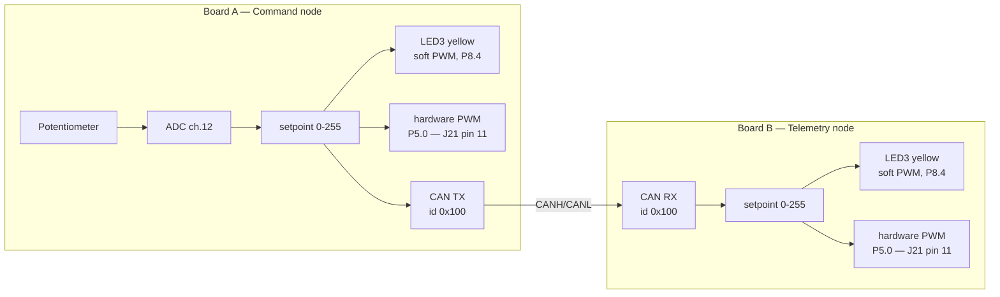

# PSOC™ Control — Command & Telemetry over CAN
### Zephyr on PSOC™ Control — Lab Guide (DevCon FAE Training)

|  |  |
| --- | --- |
| **Board** | KIT_PSC3M6_EVAL (PSOC™ Control C3M6), two per pair |
| **Duration** | 60 minutes |
| **Prerequisite** | A working workspace from the Software General Session — see §3 |
| **You will touch** | Devicetree, Kconfig, and application code |
| **Status** | Hardware-validated end to end on two boards |

App source: `labs/` in the training repo. Developer/build reference: `labs/README.md`.

---

## 1. Why this lab is shaped the way it is

This lab is the **sensing → networking → actuation plumbing** that a real motor-control or power-conversion system is built on: read an analog input, package it, put it on a real-time fieldbus, and act on it at the far end. PSOC™ Control targets motor control and power conversion, and CAN/CAN FD is a common fieldbus in those systems — which is why the hour is spent here.

**This is not a closed-loop motor control demo.** While there are certain limitations, Zephyr is capable of motor control, but a control loop is its own design exercise, with its own timing analysis, and it does not fit in sixty minutes. What you are building here is the layer such a loop sits on top of.

The reason it takes an hour is that the three places a Zephyr application is actually assembled all have to agree with each other. **Devicetree** says what hardware exists. **Kconfig** says what software gets built. **Application code** says what any of it is for. When they disagree, the board usually says nothing at all.

It is also a **paired lab**. Your board is half of a system, and the finish line needs both halves running.

---

## 2. What you're building

Each pair of attendees gets **two boards** running the **same lab project**, built twice with a different role selected each time:

| Role | Nickname | What it does |
|---|---|---|
| **Command node** (Board A) | "the knob" | Reads the on-board potentiometer via ADC → converts to a 0–255 setpoint → drives its own LED3 brightness locally (instant feedback) → transmits the setpoint over CAN every 50 ms |
| **Telemetry node** (Board B) | "the mirror" | Receives the setpoint over CAN → drives its own LED3 to the same brightness |

Turn the pot on Board A → LED3 brightness changes immediately on **both** boards, live. That live cross-board sync is the "aha" moment of the lab.



One setpoint drives **two** outputs on each board: the on-board LED3, dimmed in software, and a genuine hardware PWM signal on P5.0. Both boards do both — the telemetry node runs the same output helper, so whatever you can scope on Board A you can scope on Board B.

---

## 3. Before you start (3 min)

### Four checks

Everything here was done in the Software General Session. This is a check, not a setup — but do it now rather than at minute 29, because none of it is fixable mid-lab.

1. **Your workspace exists and your toolchain is registered.** From inside `devcon-ws`:

```
   west sdk list
```

   You want version `1.0.1` with `arm-zephyr-eabi` listed. If the command is not recognised, you are not in `devcon-ws`.

2. **Your board enumerates.** One USB cable to the **debug USB connector**, and a COM port in Device Manager. Note the number — in this lab your partner has one too, and they will not be the same.

3. **Your serial console is open** at **115200 8N1**.

4. **You have flashed this board at least once** — the blinky from the Software General Session counts.

If any of these fail, pair with a neighbour for the hour. In a paired lab that is less of a compromise than it sounds: you still need two boards between you either way.

### Pick your tier

The lab ships as **three parallel copies of the same application**, differing only in how much of the code is written for you. There is no instructor allocation and no wrong answer — same lab, same steps, same step numbers.

| Tier | Pick it if | What the TODOs give you |
|---|---|---|
| **`can-lab-beginner`** | You want to see the system work end to end, or you'd rather not fight API signatures under time pressure | Everything the advanced tier gives you, **plus** a paste block containing the exact code |
| **`can-lab-advanced`** | You want to write the driver calls yourself | The function to call, its arguments described in prose, what to do with the result, and a link to the API reference — but **no line you can transcribe** |
| **`can-lab-cheat`** | You're behind, or you'd rather read working code than write it | The finished code, with every TODO comment still in place beside its answer |

**Switching tiers mid-lab costs you nothing.** Steps 1 and 2 are byte-identical across all three trees, so you can copy your overlay and `prj.conf` across and carry on. If you are undecided, take `can-lab-beginner`.

`can-lab-cheat` exists for a specific reason: **this is a paired lab, and it only works if both boards run.** If you're stuck, taking the finished code is a better outcome than stranding your partner. Use it without ceremony.

The rest of this guide writes the folder as `<tier>`.

### The build command you'll use all hour

Your first build names everything; every build after it is a short form, because `-d build/lab` means west reuses the same build directory and already remembers your board and source tree. From inside `devcon-ws`:

```
west build -b kit_psc3m6_evk -d build/lab -s devcon-training-2026/labs/can-lab-<tier> -- -DEXTRA_CONF_FILE=conf/role_command.conf
west flash -d build/lab
```

After that, a rebuild is just:

```
west build -d build/lab
west flash -d build/lab
```

**Nothing is pre-built.** Your first build is in §7, takes a minute or two, and every build after it is incremental.

> **`kit_psc3m6_evk` is not a typo.** The kit is called **KIT_PSC3M6_EVAL**, but the board identifier currently in Zephyr is `kit_psc3m6_evk` — a holdover from the earlier C3M5 kit, which really was an EVK. Type it as `kit_psc3m6_evk` wherever a command or filename needs it; this guide uses the kit's real name in prose. The mismatch has been raised with the Zephyr platform team.

---

## 4. Your board at a glance

### The two user LEDs, and the names that do not line up

**The silkscreen and the devicetree number these LEDs differently.** The board labels its two user LEDs **LED3** and **LED4**; Zephyr's aliases for those same two parts are `led0` and `led1`. There is no rule to derive here and the offset is not off-by-one — just read the table, and fix it in your head now rather than at minute 40:

| Silkscreen | Colour | Devicetree alias | Pin | Used in this lab for |
|---|---|---|---|---|
| **LED3** | Yellow | `led0` | P8.4 | Brightness / setpoint — this is the one that tracks the knob |
| **LED4** | Blue | `led1` | P8.5 | CAN health on the command node; receive activity on the telemetry node |
| *(not an LED)* | — | `cmd-pwm` | **P5.0 — J21 pin 11** | The real hardware PWM output — scope test point, or drive your own LED |

This guide uses the silkscreen names in prose, because that is what you are looking at, and the alias names when talking about code.

**LED4 is worth watching all hour — but it does not mean the same thing on both boards.** That is deliberate, and it is the fastest way to tell your two boards apart from across the room.

| Board | LED4 behaviour | Dark means |
|---|---|---|
| **Command node** | Steady lit while the CAN controller is error-active | The controller has dropped to error-passive or bus-off — nobody is acknowledging its frames |
| **Telemetry node** | Blinks at roughly 1 Hz while setpoint frames are arriving | No frames have arrived for a second — the link has stalled |

The two differ because a **receive-only node never transmits**, so it never accumulates transmit errors. Pull the bus wires out of a telemetry node and its controller stays perfectly error-active; it simply hears silence. Driving its LED4 from controller state would leave it stuck on during exactly the failure you want it to show. Receive activity is the honest signal for that node, and you will write that logic yourself in TODO 3d.

In Phase 1 below every board is alone on the bus: the command node's LED4 will be dark, and the telemetry node's will be dark too because nothing is arriving. When you wire your pair together in Phase 2, the command node's LED4 goes steady and the telemetry node's starts blinking.

### Why your LED is driven in software — and how the production tree gets around it

Neither P8.4 nor P8.5 has a TCPWM option in its pin-mux table. A hardware PWM signal cannot be muxed **directly** onto either of them. So in the tier you are about to edit, the lab does both things at once:

- You enable and drive the **real hardware TCPWM peripheral**. That output is live on **P5.0, J21 pin 11**, and you can put a scope on it.
- The same duty cycle is **mirrored onto LED3 in software** by a provided helper (`src/lab_led.c`), so the whole room can see it without a scope.

That keeps the hour on CAN, ADC and PWM rather than on pin-mux archaeology. It is not, however, the only answer. P8.4 does have a `PERI_TR_IO_OUTPUT60` option in its table, and the PSOC™ Control **trigger multiplexer** can route the TCPWM counter's trigger line — which carries the PWM waveform itself — onto it. The `can-lab-production` tree takes that route by default and drives LED3 with genuine hardware PWM, no CPU in the path. §11 has the detail and the build commands if you want to see it.

### Optional — put an LED on the PWM pin

If you have an LED and a resistor to hand, P5.0 is the pin that gives you a genuine hardware-dimmed LED rather than a bit-banged one. It is worth doing if you want to see the difference: the hardware output is rock-steady at any duty cycle, because no thread is involved in producing it.

Wire the LED's **anode (longer leg) to J21 pin 11**, and its **cathode through a series resistor to GND on J21 pin 2**. The pin is 3.3 V logic, so anything from 330 Ω to 1 kΩ is sensible — the higher value is dimmer but safer, and the brightness still tracks the knob across the full range either way.

> **Keep it to one LED, and keep the resistor in.** The GPIO is not a power supply. Driving an LED directly with no resistor, or hanging a motor or a strip of LEDs off the pin, can exceed what the pad is rated to source.

### Two more board facts

**Flashing needs no special setup.** The kit carries an onboard SEGGER J-Link, so `west flash` finds the board on its own. It does require J-Link software **V9.78 or later** — that is the first release carrying the `PSC3M6GES3AH` device entry this board flashes through, and older versions fail with an `Unsupported value for 'Type' parameter` error.

**CAN needs no wiring beyond the pair.** The board carries its own CAN transceiver, already described in the board devicetree along with the standby line that enables it. You connect two boards and nothing else.

---

## 5. Touchpoint 1 — Devicetree (10 min)

File: `labs/can-lab-<tier>/boards/kit_psc3m6_evk.overlay`

> The file is named after the board, which is how Zephyr picks it up automatically when you build with `-b kit_psc3m6_evk`. You never reference it from a build command.

### What an overlay is actually for

The board's own devicetree already describes everything physically present on KIT_PSC3M6_EVAL — every pin, every peripheral instance, the pot, the LEDs, the CAN transceiver. What it deliberately does **not** do is decide which of that your application uses. A board file that switched on every peripheral would cost every application flash, RAM and boot time it did not ask for.

So an **overlay** is where your application says "I want this one, and here is how I intend to use it." That is the whole job of this touchpoint.

Two things worth holding on to while you edit it:

- **Nothing here executes.** Devicetree is a description. The build turns it into C macros that the drivers read at compile time, which is why a mistake here usually shows up as a missing symbol rather than a runtime fault.
- **Aliases decouple your code from the hardware.** Your application asks for `cmd-pwm`, not for `pwm0_6`. Point the alias at a different pin and the application does not change — which is exactly how one firmware tree supports several board builds.

### What you're adding

CAN is already enabled for you at the board level, transceiver included — nothing to do there. Your job is to **nominate** the potentiometer's ADC channel and to **name** the PWM output, marked `TODO 1a`/`1b` in the file:

| TODO | What you uncomment | Why it is needed |
|---|---|---|
| **1a** | The `io-channels` property in `zephyr,user` | `zephyr,user` is the standard place for application-specific devicetree references — it is how the app asks for "the pot" by name instead of hard-coding a channel number. The channel itself is already described by the board |
| **1b** | The `pwmleds` block and the `cmd-pwm` alias | Two pieces that have to agree: a named PWM consumer the app can open, and the alias the app actually looks up |

TODO 1b is the one most people get partly right — it is easy to declare the consumer and forget the alias. The starting application catches that for you with a one-line build error. In the field, nothing will.

> **Stuck?** `labs/can-lab-cheat/boards/kit_psc3m6_evk.overlay` is the finished version of this exact file, with every TODO comment still in place beside its answer. Reading it costs you nothing.

---

## 6. Touchpoint 2 — Kconfig (2 min)

File: `labs/can-lab-<tier>/prj.conf`

Devicetree said the hardware exists. Kconfig decides whether the **driver** for it gets compiled in at all. Both have to be true, and forgetting this one is the single most common first-week Zephyr mistake.

Uncomment two lines:

```
CONFIG_ADC=y
CONFIG_PWM=y
```

(`CONFIG_CAN=y` is already on in the baseline.)

---

## 7. Checkpoint — your first build (5 min)

Build and flash now, before writing any code. It takes about two minutes and proves your devicetree and Kconfig edits are correct **in isolation** — which is far easier than debugging them later with half-finished application code in the way.

```
west build -b kit_psc3m6_evk -d build/lab -s devcon-training-2026/labs/can-lab-<tier> -- -DEXTRA_CONF_FILE=conf/role_command.conf
west flash -d build/lab
```

It should build with exactly two warnings — `'can_dev' defined but not used` and `'tx_done_cb' defined but not used`. Both are correct: you have not called `can_send()` yet. Expected console:

```
*** Booting Zephyr OS build ... ***
[00:00:00.000,335] <inf> command_node: Command node starting (PSOC Control CAN lab)
[00:00:00.000,335] <inf> command_node: setpoint 128 (50%)
[00:00:00.502,502] <inf> command_node: setpoint 128 (50%)
```

| What you should see | Why |
|---|---|
| **LED3 (yellow) at a constant 50%** | The PWM path from Steps 1 and 2 works |
| **LED4 (blue) dark** | Correct — the CAN controller has not been started yet, so there is no healthy bus to report |
| **The knob does nothing**, setpoint pinned at `128` | Correct — `read_setpoint()` is still a stub |
| **No CAN traffic at all** | Correct — `send_setpoint()` is still empty |

If the console is silent or LED3 is dark, the problem is in Step 1 or Step 2 — not in code you have not written yet.

---

## 8. Touchpoint 3 — Code (25 min)

Files: `src/command_node.c` (Board A role) and `src/telemetry_node.c` (Board B role).

Steps 1 and 2 were edits to lines that already existed. Here you are filling in function bodies that are empty, which is why this step gets 25 of the 60 minutes. What that means in practice depends on your tier: in **advanced** you write the calls yourself from a prose description of each one, and in **beginner** every TODO is followed by an answer block you copy in. Either way you end up looking at the actual Zephyr APIs — `device_is_ready()`, `can_set_bitrate()`, `adc_read_dt()`, `can_send()` — because those are what you'll reach for on a real project.

> **You complete *both* files.** You are not splitting the work with your partner. Both roles are built from the same tree; a Kconfig fragment picks which `.c` file is compiled in. You'll see that pay off in §9.

**Command node (`src/command_node.c`) — four TODOs:**

| TODO | What you write |
|---|---|
| **3a** | Bring up the CAN controller in `run_command_node()`: `device_is_ready()`, then `can_set_bitrate()`, `can_set_mode()`, `can_set_state_change_callback()` and `can_start()` — in that order. The callback must be registered **before** the controller starts, or the first transition out of error-active is missed |
| **3b** | In `read_setpoint()`: call `adc_read_dt()`, then scale the 12-bit sample (0–4095) down to an 8-bit setpoint (0–255). *Hint: 12 bits is 4 more bits than 8, and a right-shift halves a value* |
| **3c** | In `send_setpoint()`: fill a `struct can_frame` (`.id`, `.dlc`, `.data[0]`) and hand it to `can_send()` |
| **3d** | One line in `run_command_node()`: `adc_channel_setup_dt(&pot_adc)` — the channel must be configured once before it can be read |

**Telemetry node (`src/telemetry_node.c`) — four TODOs:**

| TODO | What you write |
|---|---|
| **3a** | CAN bring-up: `device_is_ready()`, then `can_set_bitrate()`, `can_set_mode()` and `can_start()`, in that order. Both boards must use the same bitrate. *(One call shorter than the command node's 3a — this node never registers a state-change callback, and TODO 3d is where you'll see why)* |
| **3b** | Declare a `struct can_filter` for `CAN_ID_SETPOINT` and register it with `can_add_rx_filter_msgq()`. **Without a filter the controller receives nothing** — the step people most often forget |
| **3c** | In `unpack_setpoint()`: read the setpoint back out of `frame->data[0]`, checking `frame->dlc` first |
| **3d** | LED4, in two halves. **Part 1** sits in the receive-timeout branch: call `can_get_state()` and log the result, then drive LED4 dark. **Part 2** sits in the receive path: toggle LED4 on a `k_uptime_get()` timer so it blinks at ~1 Hz. See the note below for why this node earns its own answer |

> **Why the telemetry node does not just copy the command node's LED4.** The command node drives LED4 from the CAN controller's error state, and that works because it *transmits* — nothing acknowledges its frames, its transmit error counter climbs, the controller leaves error-active and the LED goes dark. A receive-only node never transmits, so that counter never moves. Unplug the bus from a telemetry node and it stays error-active and simply hears nothing: the same LED logic would leave it confidently lit during the exact failure it is meant to report. That is why TODO 3d part 2 blinks on *arriving frames* instead, and why part 1 calls `can_get_state()` explicitly — "the bus is healthy and nothing is arriving" and "the bus is in trouble" are different faults that look identical from this node until you ask.

Everything else is provided. You write no PWM code — LED brightness is handled in `src/lab_led.c`, which is why PWM appears in Steps 1 and 2 but not here. `can_protocol.h` holds the shared constants so both roles agree on the wire format.

> **A note on style.** The lab code omits error checks on calls that can't realistically fail on a known-good board, to keep each function short enough to read in one go. Production code should check them — `can-lab-production` (§11) keeps the full error handling and is the version to show a customer.

> **Stuck?** Diff your file against `can-lab-cheat` rather than copying the whole thing — you'll see exactly which TODO is unfinished.

---

## 9. Bring the pair up (10 min)

Two phases, in this order. The first is deliberately a single-board test, so that if something is wrong you know it is your board and not the link.

### Phase 1 — Everyone runs the command role, boards NOT wired

Each partner builds and flashes the **command** role on their own board:

```
west build -d build/lab
west flash -d build/lab
```

Expected console:

```
*** Booting Zephyr OS build ... ***
[00:00:00.000,366] <inf> command_node: Command node starting (PSOC Control CAN lab)
[00:00:00.000,427] <inf> command_node: setpoint 52 (20%)
[00:00:00.001,281] <wrn> command_node: CAN send failed - is the second board powered and wired?
[00:00:00.502,180] <inf> command_node: setpoint 52 (20%)
[00:00:01.003,769] <inf> command_node: setpoint 61 (23%)
```

| What | Expected |
|---|---|
| LED3 (yellow) | Brightness **tracks the potentiometer** immediately |
| LED4 (blue) | **Dark** — you are alone on the bus, so the controller is not error-active |
| Console `setpoint` | Sweeps the full 0–255 / 0–100% range as you turn the knob |
| Console warnings | Exactly **one** `CAN send failed` line, near the top |

> **That CAN warning is good news.** A lone CAN node has nobody to acknowledge its frames, so its transmit mailboxes fill and `can_send()` starts refusing new frames. Seeing the warning means your controller and transceiver actually came up — a board that never got that far would print nothing. It appears once, and a `CAN send recovered` line follows the moment a second node joins.

At the end of Phase 1 every attendee has independently proven ADC → PWM → console, with no dependency on their partner.

### Phase 2 — One partner switches role, then wire the pair together

**One** of the two boards rebuilds as the telemetry node. Same source tree, same build directory, same code you just wrote — one different build flag:

```
west build -d build/lab -- -DEXTRA_CONF_FILE=conf/role_telemetry.conf
west flash -d build/lab
```

No `--pristine`, and no need to name the board or source tree again: west notices the changed Kconfig fragment and re-runs configuration for you.

Now connect the two boards' CAN connectors with three wires:

| Board A | Board B |
|---|---|
| CANH | CANH |
| CANL | CANL |
| GND | GND |

You are wiring transceiver-to-transceiver — each board carries its own TLE9251V — not MCU pin to MCU pin. No termination resistor is needed at bench distances; a production bus needs 120 Ω at each end.

> **There is no transceiver node in the overlay, and that is correct — but not because there is nothing to switch on.** This board's TLE9251V has an active-high standby pin on **P12.5**, and it must be driven for the board to transmit. The board devicetree already declares it (`can_phy0`, a `can-transceiver-gpio` node) and attaches it to the controller, so Zephyr's CAN driver takes the transceiver out of standby for you when the bus starts. Your overlay adds nothing because the board file already did the work. On a board whose devicetree omitted that node, the symptom is unpleasant: everything initialises cleanly, and nothing ever reaches the wire.

Within a second of the last wire, both consoles should log `CAN send recovered`, the telemetry board should print `CAN link up - receiving setpoints`, and **its LED3 should follow the other board's knob** within about 50 ms. That is the finish line.

> **This is the payoff for the role-select design.** Nothing was recompiled from different sources and no code changed — one Kconfig fragment selected a different `.c` file, and the board changed role. That is how a real product family ships one firmware tree across several node types.

---

## 10. Verification and troubleshooting (5 min)

Serial settings for both boards: **115200 8N1, no flow control** — the console is on `uart1`, exposed through the onboard J-Link USB-UART bridge.

All four of these should be true:

| # | Check | Expected |
|---|---|---|
| 1 | Both consoles | A `command_node` / `telemetry_node` banner at boot, then a `setpoint <n> (<n>%)` line about twice a second |
| 2 | **Turn Board A's knob** | Board A's LED3 brightness changes immediately, and its console `setpoint` sweeps |
| 3 | **Watch Board B while turning Board A's knob** | Board B's LED3 tracks Board A's within ~50 ms. **This is the finish line** |
| 4 | Both boards' LED4 | Command node **lit and steady**; telemetry node **blinking at about 1 Hz**. Together that confirms the pair is wired correctly and terminated |

> **Read LED4 first.** It is the fastest diagnostic on the board, and it separates wiring faults from code faults in about a second. Remember the two nodes report different things — command node = bus health, telemetry node = frames arriving:
>
> - **Command node dark** — nothing is acknowledging its frames. The fault is in the wiring, or one of the boards is not actually powered and running. Not in your decode or display code.
> - **Command node lit, telemetry node dark** — the bus is healthy and frames are being acknowledged, so the problem is above the wire: a missing RX filter, a role mix-up, or a decode bug. The telemetry console will also be printing the `CAN controller is error-active` line from TODO 3d, which says exactly that.
> - **Command node lit, telemetry node blinking** — the link is good. Any remaining fault is in display, not in CAN.
>
> Check it before you start re-seating wires.

| Symptom | Cause and fix |
|---|---|
| `setpoint` pinned at exactly `128`, never moves | A placeholder is still in place — TODO 3b (command) or TODO 3c (telemetry) |
| Command node's LED4 dark | Nobody is acknowledging frames. Check power and all three wires. **CANH must reach CANH and CANL must reach CANL** |
| **Both** LEDs follow **their own** knob, consoles look clean | Both boards were flashed as the command node. It looks like a working system — the only tell is that turning one knob does nothing to the other board. Reflash one with `conf/role_telemetry.conf` |
| Neither LED responds; both print `No setpoint for 500 ms` | Both flashed as telemetry — nobody is transmitting. Reflash one with `conf/role_command.conf` |
| Board B prints nothing after its boot banner, **but the command node's LED4 is lit** | The bus is fine, so this is not wiring. The RX filter was never registered (TODO 3b) — without it the controller receives nothing |
| Telemetry node's LED4 never blinks, or stays stuck lit | TODO 3d is incomplete. Part 2 does the blinking; part 1 is what drives it dark again when frames stop |
| No `CAN send recovered` line after wiring | Check both boards are powered and programmed, then all three wires. **CANH must reach CANH and CANL must reach CANL** — the ground wire is never the cause |

> **Give it ten seconds after fixing a wire.** A controller that has gone error-passive heals one count per successful frame, which at this lab's send interval is about six seconds. A pair that looks dead right after a re-wire may simply not have finished recovering — and the command node's LED4 will light the moment it has.

> **Nothing on this connector is destructive.** CAN transceivers are required to survive CANH/CANL shorted to ground, to VCC and to each other, and nothing here exceeds 5 V. Experiment freely.

---

## 11. Reference

### The fourth application tree

| App | Who it's for | What it is |
|---|---|---|
| **`can-lab-production`** | Instructors, and FAEs showing customers | The same application with full error handling on every driver call, no TODOs, plus a duplicate-command-node detector that reports the §10 failure mode explicitly on the console |

It sits on a different axis from the three tiers — it isn't "harder", and nobody writes it inside the hour.

#### It drives LED3 from the trigger multiplexer

This is the part worth showing a customer. Where your tier mirrors the duty cycle onto LED3 in software, `can-lab-production` puts the real PWM waveform on the pin:

```
tcpwm0_6 trigger line 6  ->  PERI trigger mux group 2  ->  HSIOM TR_IO_OUTPUT60  ->  P8.4 (LED3)
```

The trigger multiplexer is a PSOC™ Control hardware block whose entire job is routing signals between peripherals with no CPU in the path. It is normally talked about for things like "ADC conversion done starts a DMA transfer", but it works just as well here. The TCPWM counter's trigger **line** carries the PWM waveform itself, not just a one-shot event strobe, so routing that line to a trigger IO output puts a real, hardware-generated PWM signal on a pin that has no TCPWM option of its own.

Once the route exists, a brightness change costs exactly one PWM compare-register write. No thread, no bit-banging, no jitter — and the P5.0 header pin and LED3 track each other automatically, because they are the same TCPWM channel.

Two details explain most of the code:

- **Level, not edge.** Edge mode emits a fixed two-cycle pulse per rising edge, which would discard the duty cycle that is the whole point. Level mode passes the waveform through.
- **Inverted.** The on-board LEDs are active low, and the PWM channel runs normal polarity, so the signal is inverted on its way through the mux rather than by reconfiguring the channel.

The route is split across the two places you would expect:

| Half | Where | What it does |
|---|---|---|
| Pin-mux | `boards/led_trigmux.overlay` | Appends P8.4's `PERI_TR_IO_OUTPUT60` option to the PWM channel's own `pinctrl-0`, so the TCPWM driver applies it during normal initialisation. No extra device, no extra driver |
| Route | `src/lab_led_trigmux.c` | A single `Cy_TrigMux_Connect()` call, inverted and level-triggered |

That second half is a direct **PDL** call, because Zephyr has no driver or devicetree binding for the PERI trigger multiplexer yet. Dropping to the vendor HAL for a block Zephyr does not model is the sanctioned interim approach, not a workaround being smuggled in — and it is a fair thing to say plainly to a customer, because it is the honest state of the ecosystem today. The pin-mux half is still pure devicetree, which is the usual shape of these gaps: the part Zephyr models, it models.

#### Building and flashing it

Two boards, one per role, wired exactly as in §9. Use a **separate build directory per role** — west caches the board, source tree and configuration in the build directory, so reusing one across roles is a reliable way to flash firmware you did not intend.

```
# Board A - command node
west build -b kit_psc3m6_evk -d build/prod-cmd -s devcon-training-2026/labs/can-lab-production -- -DEXTRA_CONF_FILE=conf/role_command.conf
west flash -d build/prod-cmd

# Board B - telemetry node
west build -b kit_psc3m6_evk -d build/prod-tlm -s devcon-training-2026/labs/can-lab-production -- -DEXTRA_CONF_FILE=conf/role_telemetry.conf
west flash -d build/prod-tlm
```

The trigger-mux path is the **default**; there is no flag to turn it on. The command node confirms the route on the console at boot:

```
[00:00:00.000,335] <inf> lab_led_trigmux: On-board LED3 (P8.4) driven by tcpwm0_6 via the PERI trigger mux
```

If `Cy_TrigMux_Connect()` ever fails, that line is replaced by an error naming the status code, and LED3 stays dark while everything else — CAN, the knob, the P5.0 output — keeps working normally.

#### `LED_SOFTPWM` — the software fallback

Add `-DLED_SOFTPWM=y` to build the same application with the bit-banged LED path instead:

```
west build -b kit_psc3m6_evk -d build/prod-soft -s devcon-training-2026/labs/can-lab-production -- -DEXTRA_CONF_FILE=conf/role_command.conf -DLED_SOFTPWM=y
west flash -d build/prod-soft
```

One flag switches **both** halves of the route: it selects `src/lab_led_softpwm.c` over `src/lab_led_trigmux.c` and drops the pin-mux overlay, leaving P8.4 as a plain GPIO. The application is identical from the outside — same CAN traffic, same console, same P5.0 output — so the two builds are a clean A/B of hardware versus software LED drive.

| | Default | `-DLED_SOFTPWM=y` |
|---|---|---|
| LED3 driven by | TCPWM, via the trigger mux | A dedicated thread toggling a GPIO |
| CPU cost of a brightness change | One register write | Continuous, for as long as the LED is lit |
| P8.4 pin function | `PERI_TR_IO_OUTPUT60` | GPIO output |
| Flash / RAM | 51,020 B / 12,608 B | 50,828 B / 13,120 B |

Note that `LED_SOFTPWM` is a CMake variable, not a `CONFIG_` symbol — it belongs after the `--` alongside `EXTRA_CONF_FILE`, and it is simplest to give each variant its own build directory rather than switching one back and forth.

### Looking things up while you work

Every TODO ends with a **`Docs:`** line linking to the Zephyr reference page for the calls that step needs. You are not expected to work from memory.

The distinction worth taking away from the hour:

| | Page | What it tells you |
|---|---|---|
| **The API you call** | [`group__can__interface.html`](https://docs.zephyrproject.org/latest/doxygen/html/group__can__interface.html) | `can_send()`, `can_start()`, `struct can_frame` — what your application uses |
| **The API a driver implements** | [`structcan__driver__api.html`](https://docs.zephyrproject.org/latest/doxygen/html/structcan__driver__api.html) | The table of function pointers Infineon's driver fills in behind those calls |

That split is why the `can_send()` you write here would run unchanged on a different vendor's Zephyr board: your application targets the generic API, and the vendor driver supplies the implementation underneath. It is also why the devicetree work in Step 1 matters — devicetree is what binds the generic API to this particular silicon.

| Area | Page |
|---|---|
| ADC API | https://docs.zephyrproject.org/latest/doxygen/html/group__adc__interface.html |
| ADC concepts and devicetree properties | https://docs.zephyrproject.org/latest/hardware/peripherals/adc.html |
| CAN controller concepts | https://docs.zephyrproject.org/latest/hardware/peripherals/can/controller.html |
| PWM concepts | https://docs.zephyrproject.org/latest/hardware/peripherals/pwm.html |
| Devicetree — what an overlay is | https://docs.zephyrproject.org/latest/build/dts/intro.html |
| Devicetree — every in-tree binding | https://docs.zephyrproject.org/latest/build/dts/api/bindings.html |
| Kconfig — searchable index of every `CONFIG_` symbol | https://docs.zephyrproject.org/latest/kconfig.html |

The last two are the ones worth bookmarking. "What properties can this node have?" is answered by the bindings index; "what does this `CONFIG_` do?" by the Kconfig index.

### Build times

| Build | Roughly |
|---|---|
| Your first build (§7, clean) | **1½ – 2 minutes** |
| Role switch, Phase 2 | 1½ minutes |
| An edit to your overlay | 40 seconds |
| An edit to a `.c` file only | under 10 seconds |
| Re-running a build you have already done | 2 seconds |

The first build is slow because nothing has been compiled for your board yet. Everything after it reuses `build/lab`. A Kconfig change — which is what the Phase 2 role switch is — invalidates enough of the tree to rebuild most of it, and is still faster than `--pristine`.

### If something doesn't behave as described

Every step in this lab has been run end to end on two physical boards, wired CANH/CANL/GND, including the deliberate failure modes. If something here does not behave the way the guide says it will, that is worth raising rather than working around.
